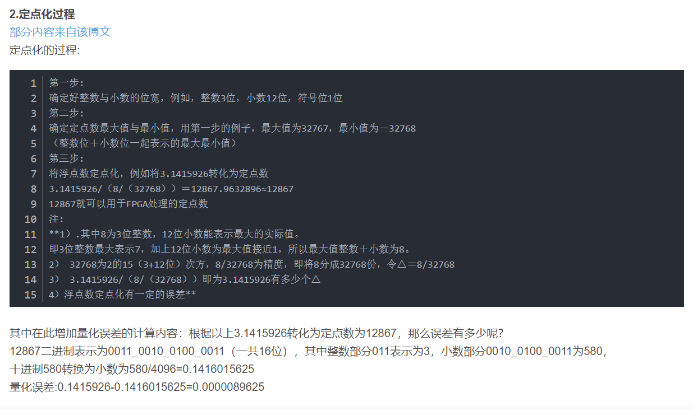
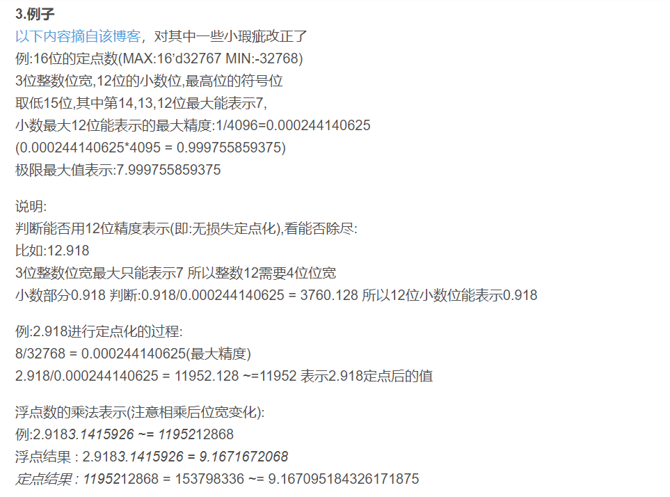
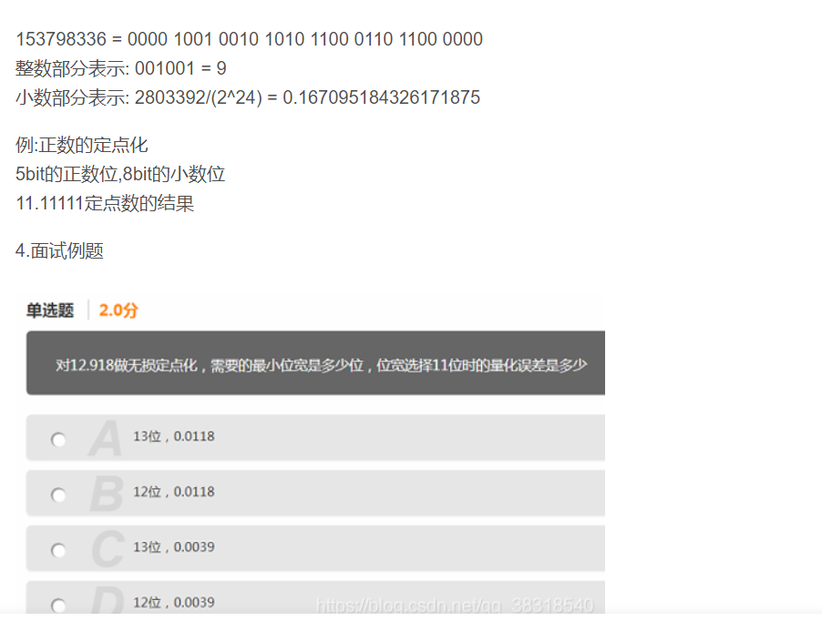
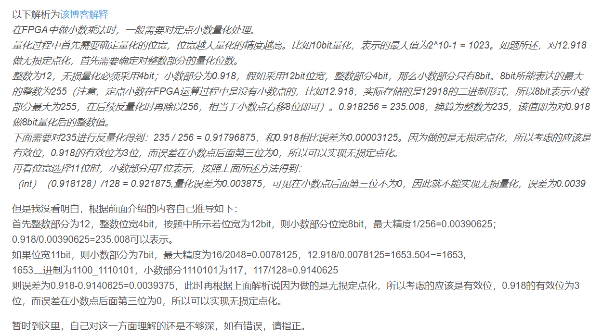

浮点数转定点数：

先量化再转化为二进制：a=2.1345; b=quantizer([8 5]); c=num2bin(b,a); 就可以查看c的二进制格式了

定点数转浮点数：

先确定定点数的表示方式，再用bin2num转换为十进制：

d=quantizer([8 5]); e=bin2num(d,c); 其中c为浮点转定点输出的数据

1.基础概念
浮点数:
简单来说，就是小数点的位置不是固定的
定点数:
简单来说，小数点的位置是固定的，也就是整数位宽与小数的位宽是固定的
以下部分内容摘自该博文
因为在普通的fpga芯片里面，**寄存器只可以表示无符号型**，不可以表示小数，所以在计算比较精确的数值时，就需要做一些处理，不过在altera在Arria 10
中增加了硬核浮点DSP模块，这样更加适合硬件加速和做一些比较精确的计算。
　　在verilog里面，如果用用16位二进制表达定点小数，最高位就是符号位。我们把小数点之后的N位叫做Qn，例如小数点之后有12位叫做Q12格式的定点小数
而Q0就是我们所说的整数。
　　Q12的最大正数是0111.1111_1111_1111，第一个0是符号位，后面的数都是1，那么这个数的十进制就是0x7fff/212=7.99999…，为啥是除212呢，因为是
十二位小数，0.1111_1111_1111接近与整数1，这样看有多少个1.
反过来，一个实际的数转换成Qn型的定点小数就是就是乘上2^n

